
# Unidad 1. Introducción a Flutter

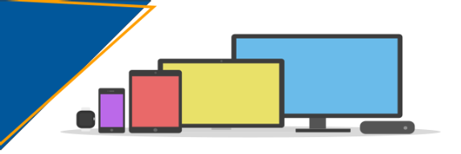

Flutter representa hoy en día una de las opciones más completas para el desarrollo de aplicaciones multiplataforma, y permite, con un único código fuente, generar aplicaciones nativas para distintas plataformas, de escritorio, móviles y web.

En esta unidad introductoria veremos cómo realizar su instalación, así como las herramientas necesarias para la edición de código y su ejecución en distintos dispositivos.

[*1. Desarrollo multiplataforma y Flutter*](#_apartado1)

[*2.	Instalación del SDK Flutter*](#_apartado2)

[*3.	Instalación y configuración de VSCode*](#_apartado3)

[*4.	Emuladores*](#_apartado4)

[*5.	Proyectos con Flutter*](#_apartado5)


# 1. <a name="_apartado1"></a>Desarrollo multiplataforma y Flutter

## ¿Qué entendemos por aplicaciones multiplataforma?
Cuando hablamos de **aplicaciones multiplataforma** nos referimos a aquellas aplicaciones que son desarrolladas en un único lenguaje de programación y que facilitan su exportación y ejecución -con cambios mínimos- a cualquier dispositivo, de manera independiente al sistema operativo.

Por otro lado, se encontrarían las **aplicaciones nativas**, que se desarrollan específicamente para cada sistema, mediante lenguajes y tecnologías propias y específicas. Un claro ejemplo de ello son el lenguaje Swift, creado por Apple para el desarrollo de aplicaciones para iOS, Mac o Apple TV, o Kotlin, para el desarrollo de aplicaciones para Android.

## Aproximaciones al desarrollo multiplataforma
Con el fin de minimizar el desarrollo específico en cada plataforma, y el coste que ello supone, aparecen varias tecnologías, centradas sobre todo en tecnologías web. Dentro de ellas, disponemos de un gran abanico de posibilidades:

1. **Aplicaciones web responsivas**: Se trata de aplicaciones basadas en tecnología web: HTML, CSS y JavaScript, que adoptan su interfaz a cualquier dispositivo (diseño *responsive*). Estas aplicaciones no requieren de ningún desarrollo nativo, ya que se ejecutan sobre el propio navegador web del sistema. Así pues, disponemos de un código único, pero que no ofrecen una experiencia de usuario tan fluida como las aplicaciones nativas, ni permiten el acceso a todos los componentes del sistema.
   
2. **Aplicaciones híbridas**: Se trata de aplicaciones web responsivas que se cargan dentro de un componente de tipo *WebView* del sistema, que no es más que un navegador sin la barra de navegación, por lo que presenta la apariencia de una aplicación nativa. Estas aplicaciones, además, también permiten el acceso a través del *WebView* a algunas características del dispositivo, como la ubicación o el acelerómetro. El framework para el desarrollo de aplicaciones híbridas más popular es ***Ionic**, que* permite el desarrollo con otros frameworks web como *React*, *Angular* o *Vue*.
   
3. **Aplicaciones web progresivas (PWAs)**: Las PWAs siguen siendo aplicaciones web, pero que gracias a determinados componentes, como los *Service Workers* y otras tecnologías están más cerca de las aplicaciones nativas, de manera que permiten sacar mayor potencial de las mismas, accediendo al hardware, trabajar con poca conexión o sin ella, u ofrecer notificaciones del sistema. Existen varios frameworks para el desarrollode PWAs, entre los cuales se encuentran *React PWA Library*, *Angular PWA Framework*, *Vue PWA Framework*, *Ionic PWA Framework*, *Svelte*, *PWA Builder* o *Polymer*.

Como hemos comentado, estos tres tipos de aplicaciones se basan en el uso de tecnologías web y algún componente, bien sea el propio navegador o un *WebView*. Aunque hay aplicaciones muy buenas basadas en estas tecnologías, no aportan todas las funcionalidades ni la fluidez de una aplicación nativa.

Un paso más allá en el desarrollo multiplataforma, se encuentran los frameworks que, partiendo de un mismo código base, generan aplicaciones compiladas de forma nativa para los diferentes sistemas operativos. Algunas de las tecnologías más utilizadas en este tipo de aplicaciones son:

1. **React Native** y **Native Script**: Que utilizan como base el lenguaje de programación JavaScript, pero en lugar de construir las interfaces mediante HTML, utilizan componentes propios del framework que son compilados a código nativo, haciendo ya innecesario utilizar un WebView como intermediario.
1. **Flutter**: Este framework, **creado y mantenido por Google** permite el desarrollo de aplicaciones multiplataforma mediante el lenguaje *Dart*. Estas aplicaciones son compiladas a código nativo de los diferentes sistemas operativos (Android, iOS, Linux, Windows) e incluso web. Flutter, es además la tecnología nativa del sistema operativo Google Fuchsia, basado en su propio microkernel *Zircon*, y que a medio o largo plazo podría ser el reemplazo de Android.


## ¿Qué es Flutter?
Flutter es un conjunto de herramientas para el desarrollo de software (SDK) y un marco de trabajo (framework) de código abierto creado por Google en 2017 y orientado al desarrollo de aplicaciones multiplataforma, con la idea de obtener, con el mismo código de base, aplicaciones compiladas en código nativo específico de cada plataforma.

Aunque el núcleo se encuentra desarrollado en C++, Flutter utiliza el lenguaje de programación ***Dart***, desarrollado también por Google en 2011 como altenativa a JavaScript, y con la idea de suplir algunas deficiencias del mismo. Dart se ejecuta sobre una máquina virtual DartVM, que permite dos tipos de compilación: *JIT* y *AOT*. La compilación ***JIT (just-in-time)*** se realiza durante la propia ejecución en la máquina virtual de Dart, mientras que la compilación ***AOT (ahead-of-time)*** o compilación con anticipación se realiza de manera previa a la ejecución y se hace al lenguaje nativo de cada plataforma.

Otro de los pilares de Flutter es el motor de renderizado 2D *Skia*. Flutter no utiliza los componentes de interfaz nativos de cada plataforma, sino que utiliza sus propios componentes y los renderiza mediante Skia, ofreciendo un aspecto y comportamiento prácticamente equivalente a los nativos.

Todo ello aporta a Flutter las siguientes características:

* Stateful Hot Reaload, o recarga en caliente con estado, gracias a la compilación JIT, y que nos permite hacer cambios en el código y visualizarlos de manera instantánea en las vistas sin necesidad de volver a cargar todo el contexto gráfico.
* Rendimiento prácticamente nativo, ya que el código compilado de manera *OAT* genera código nativo.
* Permite crear aplicaciones con interfaces gráficas vistosas, con un comportamiento prácticamente nativo gracias a Skia. Este motor, además, permite el renderizado hasta 60 fps (*frames por segundo*), lo que implica animaciones de gran calidad.

De todas formas, debemos tener en cuenta que no estamos realizando desarrollos con un entorno puramente nativo, de manera que:

* Principalmente, cuando desarrollemos para plataformas móviles, no dispondremos de manera inmediata de las últimas características de los sistemas operativos, ya que éstas se incorporan de manera prioritaria a los entornos nativos.
* Las aplicaciones multiplataforma son más pesadas y menos escalables que las nativas, ya que deben estar preparadas para interactuar con diferentes sistemas,
* Tienen un rendimiento ligeramente inferior a las aplicaciones nativas puras ya que no están tan optimizadas como las compiladas con las herramientas nativas.

Otra posibilidad, en caso de que necesitemos características específicas de un sistema, es la realización de desarrollos híbridos, con una parte común con Flutter, y otra con tecnología nativa y específica para cada dispositivo.

## Arquitectura de Flutter
La arquitectura de Flutter se compone de un sistema extensible de capas independientes, donde cada capa superior depende de la capa inferior a ella. En la siguiente imagen podemos ver esta arquitectura, en la que distinguimos los siguientes componentes:

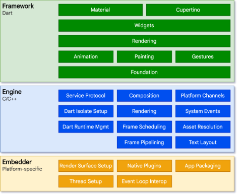

* **Framework**: La capa superior, desarrollada completamente en Dart, nos proporciona un framework moderno y reactivo al lenguaje, y que consta de cuatro subcapas:
* La capa superior, con las **librerías *Material* y *Cupertino***, que implementan los controles en los diferentes lenguajes de diseño de Android e iOS,
* **La capa de *widgets***, que implementa de manera reactiva los diferentes tipos de controles y su composición,
* **La capa de representación**, que gestiona el árbol de componentes y se encarga de su representación, y las clases fundamentales básicas y las bibliotecas de animación, colores y renderizado.
* **Engine o motor de Flutter**: Esta capa de apoyo al framework está desarrollada en C y C++, y es la responsable del renderizado de cada frame. Este motor proporciona la implementación a bajo nivel de la API principal de Flutter: el motor gráfico Skia, la representación de texto, la gestión de la entrada y salida o el soporte a la accesibilidad, entre otros.
* **Embedder o integrador**, encargado principalmente del empaquetado en formato nativo y la integración de la aplicación en el sistema operativo subyacente.


## Herramientas del SDK
El SDK de Flutter puede descargarse de su propia web tal y como veremos posteriormente, y su distribución se organiza alrededor de canales o ramas de desarrollo. Principalmente, disponemos de dos canales:

* **El canal beta,** que incorpora las nuevas funcionalidades y compatibilidades con cada plataforma, porque los desarrolladores las prueban, y
* **El canal estable**, donde se incorporan las nuevas funcionalidades una vez han sido probadas y se consideran estables o con poca probabilidad de producir errores.

Como veremos, la instalación consistirá en descargar el SDK y configurar de manera correcta el PATH para que podamos acceder a las herramientas que éste proporciona.

La herramienta principal del SDK es la orden ***flutter***, una potente herramienta de la línea de comandos a través de la cual podremos acceder a todas las funcionalidades del SDK.

Los principales usos de esta orden serán:

* `flutter help` : Muestra la información de ayuda de la orden, así como las diferentes subórdenes que podemos utilizar, organizadas en tres categorías principales: Herramientas del SDK, Herramientas de creación y construcción de proyectos y herramientas para el acceso a los dispositivos virtuales.
* `flutter doctor` : Para su correcto funcionamiento, Flutter necesita de otras herramientas, como los SDK de Android o iOS, Java o emuladores. Para comprobar todos estos requisitos, Flutter proporciona la herramienta *Flutter Doctor*, que se encarga de analizar nuestro sistema y comprobar qué componentes nos faltan para poder utilizar el SDK. Cuando lanzamos la herramienta, se nos presenta un informe con aquellos componentes que requieren de instalación o configuración y cómo hacerlo.


* `flutter create` , `flutter build` ,`flutter clean` : Existen distinas subórdenes para la gestión de proyectos, pero estas serán los que más utilicemos, respectivamente para la creación, construcción, ejecución o limpieza del proyecto.
* `flutter devices` , `flutter emulators` : Se trata de dos de las herramientas más importantes para la gestión de los dispositivos. Nos muestran los dispositivos y emuladores conectados


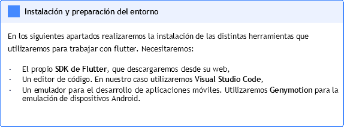


# 2. <a name="_apartado2"></a>Instalación del SDK Flutter
Para realizar la instalación del SDK para Flutter, seguimos las instrucciones de la documentación oficial (<https://docs.flutter.dev/get-started/install>).


# <a name="_apartado3"></a>3. Instalación y configuración de VSCode

## Visual Studio Code
Para la edición del código vamos a hacer uso del editor ligero multiplataforma *Visual Studio Code*, que dispone de una gran cantidad de complementos que nos ayudarán en el desarrollo de aplicaciones con Flutter.


### Descarga e instalación de VS Code

Podemos descargar directamente el software necesario desde la [web de descargas de VSCode](https://code.visualstudio.com/download), donde están disponibles los paquetes para los diferentes sistemas operativos.

- <https://code.visualstudio.com/docs/setup/windows>

## Integración de Flutter con Visual Studio Code
Visual Studio Code es un editor ligero pero extremadamente flexible mediante *plugins* o extensiones. Concretamente, para el desarrollo de aplicaciones con Flutter nos serán de gran utilidad los siguientes plugins:

[**Flutter**](https://marketplace.visualstudio.com/items?itemName=Dart-Code.flutter), que implementa el soporte para la edición, refactorización, ejecución y recarga en caliente (*hot reload*) de aplicaciones desarrolladas en Flutter.

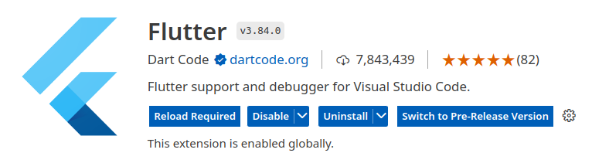

[**Dart**](https://marketplace.visualstudio.com/items?itemName=Dart-Code.dart-code), que ofrece el soporte para el lenguaje Dart en VSCode, con herramientas para la edición, depuración y resaltado de sintaxis del lenguaje. Este plugin es dependencia directa del plugin de Flutter.

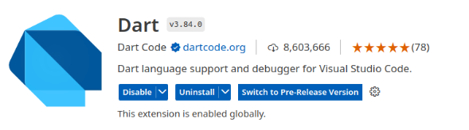

Aunque estos son los plugins necesarios para el desarrollo con Flutter, existen otros que nos pueden resultar útiles, como:

[**Pubspec Assist**](https://marketplace.visualstudio.com/items?itemName=jeroen-meijer.pubspec-assist), para incorporar fácilmente las dependencias de nuestro proyecto al fichero de configuración,

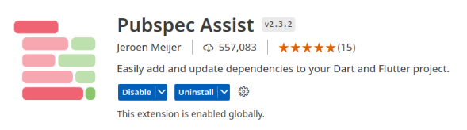

[**Awesome Flutter Snippets**](https://marketplace.visualstudio.com/items?itemName=Nash.awesome-flutter-snippets). Los *snippets* son fragmentos de código de uso común que pueden actuar como plantillas. Estos se pueden obtener escribiendo un prefijo y seleccionando el snippet que deseamos. Aunque la extensión de Flutter nos proporciona los *snippets* de uso más común, la extensión *Awesome Flutter Snippets* nos proporciona un conjunto más rico de *snippets* con plantillas de clases y métodos que permiten un desarrollo más ágil, que nos ayuda en la creación de componentes.

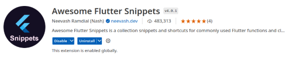

Existen también algunos packs de extensiones, como *Flutter ExtPack*, que únicamente arrastra Flutter y Dart, pero otros como *Flutter Development Extensions Pack*, *Ultimate Flutter Extension Pack* y *Complete Flutter Extension Pack*, que incluyen una gran cantidad de extensiones relacionadas con el desarrollo con Flutter.

Con esto ya tendremos preparado Visual Studio Code para trabajar con Flutter.


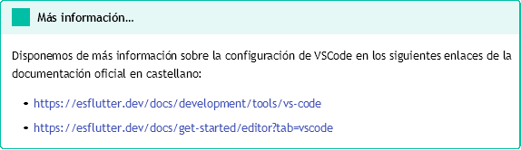

## Integración de Flutter con Android Studio
Si ya disponéis de Android Studio instalado y queréis hacer uso del mismo para crear vuestras aplicaciones con Flutter, habrá que instalar el complemento de Flutter para Android Studio, que podemos encontrar en el menú de Ajustes (*File > Settings*); dentro de la sección *Plugins*. Este plugin requerirá del plugin de Dart para Android Studio, tal y como se indica en su instalación.

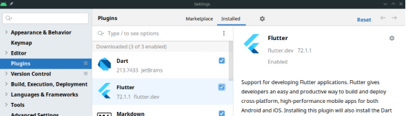


# <a name="_apartado4"></a>4. Emuladores

A la hora de trabajar con flutter para dispositivos móviles tenemos distintas opciones para poder ejecutar nuestro programa en un dispositivo móvil.

- La forma más sencilla es conectar un dispositivo móvil Android a través de wifi o mediante un cable USB. Es la opción más sencilla y rápida.
- Utilizar el emulador incorporado en Android Studio. Para ello deberemos instalarlos.
- O bien utilizar Genymotion, instalándolo como aparece en estas instrucciones: <https://docs.genymotion.com/desktop/>


# <a name="_apartado5"></a>5. Proyectos con Flutter
Para crear un nuevo proyecto con Flutter se utiliza el orden *flutter create*, con algunas opciones. Tanto VSCode como Android Studio permiten la creación de proyectos desde su interfaz, como veremos más adelante.

Antes de abordar la creación de proyectos de forma práctica, vamos a ver primeramente la estructura de un proyecto en Flutter.


## Estructura de un proyecto en Flutter
Un proyecto típico en Flutter se organiza en diferentes directorios y ficheros de configuración y código fuente. Los más importantes son:

- **Directorio lib**: Con el código fuente Dart de nuestra aplicación Flutter, que será compilado a código específico de los diferentes sistemas. La clase principal será *main.dart* y será el punto de entrada a nuestra aplicación.
- **Fichero pubspec.yaml**: Es el fichero de configuración del proyecto Flutter en formato [YAML](https://yaml.org/), donde se incluyen las dependencias en bibliotecas, se especifican recursos de imágenes, fuentes, audio o vídeo.

Además, tendremos varios directorios específicos para cada plataforma:


- **La carpeta android**: Con el proyecto completo de Android, con su estructura habitual, formada por un módulo app, los scripts de Gradle (build.gradle, settings.gradle), los ficheros de *Manifiestos* (app/src/main/AndroidManifest.xml), etc. Una vez realizada la compilación del proyecto, nuestro código Flutter se integrará en este proyecto Android, de manera que podremos abrirlo de manera independiente,  ejecutarlo y depurarlo como una aplicación Android.
- **La carpeta ios**: Con el proyecto completo para iOS. En este caso, si deseáramos abrir la aplicación para su compilación, modificación o depuración necesitaríamos XCode.
- **La carpeta web**: Con el código HTML y Javascript de nuestro proyecto para la web.

Además de los directorios para el proyecto nativo *Android* e *iOS*, podemos tener también varios directorios con el proyecto nativo para el resto de plataformas para las que estamos creando la aplicación (*linux*, *windows*, etc.).

Otros ficheros y directorios que podemos encontrar dentro de nuestros proyectos son: 

- Fichero **.gitignore**, con una configuración predeterminada para omitir ciertos tipos de ficheros del control de versiones *git*.
- Fichero **.metadata**, un fichero oculto con las propiedades del proyecto, para hacer su seguimiento.
- Fichero **analysis\_options.yaml**, con la configuración de análisis estático del código Dart, formado por un conjunto de reglas que servirán para mostrar u ocultar determinados avisos. Podemos consultar la documentación en <https://pub.dev/packages/analysis_options>.
- Fichero **Readme.md**. Se trata de un fichero en formato Markdown con la descripción del proyecto. Cuando generamos un proyecto nuevo este documento contiene algunas orientaciones genéricas y enlaces útiles sobre desarrollo con Flutter. Será nuestra tarea, como desarrolladores de la aplicación, modificar este fichero para incorporar la descripción de nuestro proyecto, así como cualquier información de interés (como hacer la instalación, dependencias, ejecutarlo, etc.)
- Fichero **pubspec.lock**, mantenido y utilizado por el framework, con información sobre cómo se han generado las dependencias. 
- Fichero **\*.iml**. Generalmente con el nombre de la aplicación y extensión iml, no es un fichero propio de Flutter, y junto con la carpeta .idea, son ficheros propios del IDE IntelliJ, y que proporcionan una configuración, tanto para éste como para otros IDEs para proyectos Flutter.
- Carpeta tests: Con las pruebas que deseamos añadir a la aplicación, y con la misma estructura de directorios que usamos en lib.


## Creación y ejecución de un proyecto en VS Code
En los siguientes apartados vamos a ver cómo crear un proyecto con Flutter. En primer lugar, veremos cómo hacerlo directamente desde VSCode, y después, y como opción recomendada, desde la línea de órdenes, que nos permitirá incorporar varias opciones adicionales.

### Paso 1. Creando el proyecto desde VSCode

Para crear un nuevo proyecto Flutter en VScode, abrimos la paleta de órdenes (*Command Palette*) con *Ctrl+Shift+P*, y seleccionamos *Flutter: New Project*:

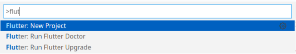

Si VSCode no encontrara directamente el SDK de Flutter, nos mostrará el siguiente mensaje, indicando que le proporcionamos el path a este:

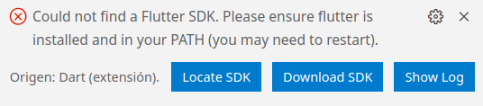

Desde ahí podremos indicar la carpeta donde se sitúa el SDK o descargarlo directamente. También se deberá indicar la misma carpeta para el plugin de Dart.

Si hemos seguido los pasos correctamente para la instalación del SDK de Flutter, no debería aparecer ningún mensaje de error. En caso de tener el SDK correctamente configurado, si nos aparece este mensaje, seguramente es porque no hemos reiniciado el equipo después de la instalación del SDK y no se esté cargando el perfil con el PATH.


Cuando el SDK está configurado, el asistente nos pide el tipo de aplicación de Flutter:

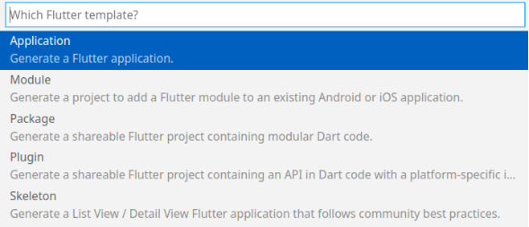

y posteriormente el directorio donde guardarlo y el nombre del proyecto. 

### Paso 2. Comprobación de los dispositivos

En la barra de estado de Visual Studio Code, situada en la parte inferior de la ventana, veremos que se nos muestra el dispositivo configurado de manera predeterminada, en este caso, Windows:

Si hacemos clic sobre él, se nos abrirá en la parte superior un menú para elegir el dispositivo sobre el que queremos ejecutar la aplicación. En este caso, se muestran las opciones de Linux, Chrome y el Galaxy S9 con Android 11 que tenemos creado. Además, si teníamos algún dispositivo virtual generado con Android Studio también nos aparecerá acá

En el caso que hayamos conectado un dispositivo Android con permiso de Desarrollador, nos solicitará permiso y podremos ejecutarlo en dicho dispositivo:

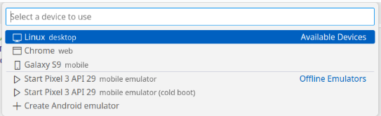

### Paso 3. Lanzando nuestra aplicación

El editor VSCode, en la parte superior derecha nos muestra los controles para ejecutar o depurar la aplicación:

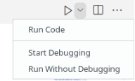

La primera opción *Run Code* ejecuta el programa que tengamos abierto en el editor, de manera que solo nos serviría para programas sencillos realizados con Dart. Si lo que queremos es ejecutar el proyecto como tal, debemos hacer uso de las opciones *Start Debugging (o F5)* para iniciar la aplicación en modo depuración, o bien *Run Without Debugging*, si no queremos ejecutar el depurador.

Así pues, si lanzamos ahora la aplicación, ésta se ejecutará sobre el dispositivo que tengamos seleccionado:

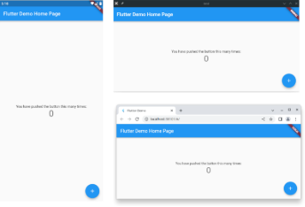

La primera vez que ejecutamos una aplicación conlleva la descarga al proyecto de varias liberias -para quienes hemos trabajado con Android, sería el equivalente a la primera vez que hacemos la construcción del proyecto ( gradle build )-, lo que implica que puede cogerse su tiempo. Las ejecuciones sucesivas serán pues más rápidas.

## Gestión de proyectos Flutter desde la línea de órdenes

Las herramientas que ofrece Flutter desde la línea de órdenes nos dan un abanico más ancho de posibilidades a la hora de crear aplicaciones y ejecutarlas en los diferentes dispositivos. 

Vamos a ver ahora **cómo crear un proyecto** y lanzarlo en los dispositivos desde la línea de órdenes. 

Recuerde que desde el propio VSCode podemos abrir la terminal integrada con **Ctrl+Shift+'**).

### Creación de un proyecto desde la línea de órdenes

La forma más sencilla de generar un proyecto nuevo en Flutter desde la línea de órdenes:

`$ flutter create <directorio>`

Que nos creará el proyecto en el directorio especificado, y para las plataformas Android, iOS, Linux, MacOS, web y Windows.

Si queremos crear el proyecto para alguna plataforma específica, haríamos uso de la opción --platforms. Por ejemplo, la orden:

`$ flutter create --platforms Android,Web,Linux ejemplo_1`

Nos creará un proyecto llamado `ejemplo_1` para las plataformas Android, web y Linux.

Vemos algunos detalles a tener en cuenta:

- El nombre del proyecto debe ser un nombre de proyecto de Dart válido, lo que implica que sólo puede estar formado por letras minúsculas, numeros (excepto el primer dígito), y el guión bajo (_). Puede consultar en la documentación de Dart estas reglas de nomenclatura.

- Si luego queremos incorporar una nueva plataforma, podemos invocar de nuevo el orden, añadiendo ésta. Por ejemplo:
  
```
$ flutter crear --plataformas ios exemple_1/

Recreando exemple_1 proyecto...
```

Creará el proyecto para la plataforma iOS, respetando el resto de código que teníamos en la aplicación.

También podemos hacer uso del punto . como nombre de proyecto para crearlo en el directorio actual. 

Por ejemplo, con:

```
$ cd exemple_1
exemple_1$ flutter crear --platform windows .
Recreando proyecto ....
```

Accedemos al directorio del proyecto y le añadimos la plataforma Windows desde dentro de la misma carpeta.

La orden `flutter` create admite muchas más opciones para personalizar la creación de proyectos. 

Podemos explorar estas ejecutando `flutter create --help`.

Podéis encontrar más información sobre la integración de las aplicaciones Flutter en los diversos entornos de escritorio en el siguiente enlace de la documentación oficial:

[https://docs.flutter.dev/development/platform-integration/desktop](https://docs.flutter.dev/development/platform-integration/desktop)


